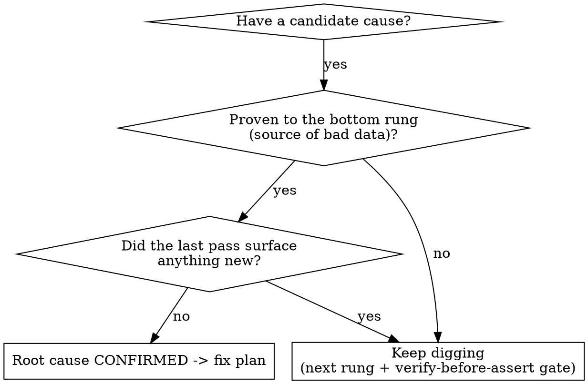

# /rca — Root-Cause Analysis (canonical)

> For per-ticket state, see [shared progress policy](/Users/akshat.v/.claude/skills/_shared/progress-policy.md).

An external signal triggers a disciplined, evidence-grounded investigation that drives to **one verified root-cause fact**, proposes the fix as two tracks, gives UI verification steps, and leaves a durable auditable artifact. This is the single home for RCA discipline (it absorbs the old `/today oncall triage` depth-bar + verify gate). Eightfold-specific data-source knowledge, bug-class patterns, and query templates live in [playbook.md](playbook.md) (lazy — read it once an investigation touches eightfold data).

**Scope stops at root cause + fix plan.** /rca confirms the cause, proposes the fix, gives before/after verification — then OFFERS `/ship-task`. It never implements or ships.

## The contract — these are the discipline rules (non-negotiable)

**Violating the letter of these rules is violating the spirit of them.** A plausible, confident answer that isn't grounded is the exact failure mode this skill exists to prevent.

1. **Triage depth bar.** Never report a *category* of cause. Drive the ladder, proving each rung before claiming it:
   `symptom → endpoint → field → exact value → value's TYPE → which owners/rows hold it → source of the bad data`.
2. **Label observed / inferred / verified on EVERY claim.** Never blur them (value `80` = observed in log; int-ness = inferred from code; both = verified by EC2 repro). Expect "where did you get that from?".
3. **Verify-before-assert gate.** Before any load-bearing claim ("X present/missing", "Y did Z", "the feature behaves like W") ask: *what would have to be true for this to be WRONG, and have I checked the source that would show it?* Pick evidence by **fitness-for-claim**, not by what's already open. **≥2 independent sources for any *absence*.** Quote the recorded artifact for any who-did-what. If not yet grounded: state it labeled + name the query that would ground it — **never assert flat**.
4. **Authoritative artifact.** Prove "present" with the source of truth (raw store / product UI), NOT a canonicalized index that drops/renames items. See playbook.md.
5. **Pinpoint actual owners/rows, not the proxy.** A log's `for user-` is the *viewer*, not the data owner — query the store for who/what truly holds the value.
6. **Two tracks.** Split the immediate symptom-stopper (a gate/flag that stops the 500) from the underlying data defect (the value is still wrong). Surface both, separately.
7. **Reproduce code hypotheses deterministically** on EC2 (`/efx`) — reading yields *inferred*, only a repro yields *verified*.
8. **Code flow → `file:line` TREE**, failing node marked. Never isolated snippets.
9. **Dual-audience.** Intern-deep + artifact-cited for the driver (Akshat — assume product known at overview level, not this ticket/feature); jargon-free + UI-confirmable + self-validatable (re-runnable SQL/link > screenshot > assertion) for CS→customer. No customer-account screenshots (PII/residency).
10. **Cite an auditable artifact on EVERY claim** (file:line / PR / log / SQL / dashboard / Slack permalink), as a markdown link with an **absolute** target. No artifact ⇒ say "unverified" out loud.

## Signal routing (auto-detect from the first arg)

| Invocation | Signal | Detected by | First moves |
|---|---|---|---|
| `/rca CS/IMPL/ENG-XXXXX` | Jira key | `^(CS\|IMPL\|ENG)-\d+` | `getJiraIssue` + comments + attachments; resolve project → vault ticket dir |
| `/rca <slack-url>` | Slack thread | host `*.slack.com` | `slack_read_thread` (NEVER send); reporter + symptom |
| `/rca <github url>` | PR / issue | host `github.com` | `gh pr/issue view` + diff; treat the change as a hypothesis to prove/disprove |
| `/rca <pd-incident \| #NNNNN \| latest>` | PagerDuty | `get_incident` resolves it | alarm / region / window — **NEVER auto-ack** |
| `/rca` (no arg) | infer-from-session | nothing matched | resume the most recent signal in this session; if none, ask one question |

**Flags:** `--report` (default ON — persist the report file), `--intern` / `--audit` (render altitude via `/onepager`), `--html` (also build an HTML artifact via `/visualize-via-html`, opt-in). The recurring re-check always uses default `/loop` (self-paced) — there is no interval flag.

## Phase flow

Each phase names the composed skill. Read playbook.md before Phase 3 if the signal touches eightfold data.

- **0 · Pickup & route** — fire `/name-session`; detect the signal (table above); resolve the target. NEVER auto-ack a PagerDuty incident.
- **1 · Recall** — `**REQUIRED FIRST:** /brain-recall <ticket|url>` (READ-ONLY; arms continuous ingest). Read [state/rca_followups.md](state/rca_followups.md) — if this signal is already an open follow-up from a prior pass, resume it.
- **2 · Calibrate altitude** — pin intern altitude up front (Akshat knows the product at overview level, NOT this ticket/feature). State the altitude in the render's source line; don't guess high and get corrected twice.
- **3 · Triage-pinpoint, loop-until-dry** — walk the depth bar (rule 1). Apply the verify-before-assert gate (rule 3) BEFORE asserting each rung. Ground via `db_explorer` (eightfold MCP, StarRocks `log.www_server_log`), `/check-gate`, `/read-config`, and the AUTHORITATIVE store (rule 4, playbook.md). Pinpoint owners/rows, not the viewer proxy (rule 5). Keep digging until a pass surfaces NOTHING new — don't stop at the first plausible cause.
- **4 · Runtime grounding** — convert inferred → verified with `**RUNTIME GROUNDING:** /efx` (`exec`/`submit`/`poll`; IPython snippet to pinpoint the failing line; HTTP repro; `--target dev|shared-eu|shared-ca` for regional prod / customer data). **Optional demo-account replication (when useful, not every time):** use `/efx` against the demo account `eightfolddemo-ashutosh.tanwar.com` to (a) set up the case and reproduce the bug, and (b) verify the proposed fix/check before recommending it (recipe in playbook.md).
- **5 · Tree-format trace** — produce the full call path as a `file:line` tree (rule 8): one-line timeline + tree, failing node marked. Rendered as part of the intern write-up via `/onepager --intern` — not a separate skill call.
- **6 · Root cause + fix plan + UI verification — SCOPE STOPS HERE** — state the single verified root-cause fact; propose the fix as two tracks (rule 6); give UI before/after steps (re-runnable SQL/link, not a screenshot — rule 9). Do NOT implement. Do NOT ship.
- **7 · Persist the RCA report (DEFAULT durable output)** — resolve the path (see [references/rca-report-template.md](references/rca-report-template.md)), fill the template. Inline-render via `**RENDER:** /onepager` (`--intern` when the feature is unfamiliar / `--audit` for the synthesis-first TTS read).
- **8 · Offer drafts + ship-task (offer, never auto-run)** — offer a jargon-free Slack/Jira draft (clean customer summary + technical backup, split). NEVER send without an ALL-CAPS YES. Offer `**HANDOFF (offer only):** /ship-task <TICKET>` for the fix — do not auto-run it. `--html` → offer `**OPT-IN:** /visualize-via-html`.
- **9 · Register the recurring /loop (ALWAYS)** — `Skill(skill="loop", args="/rca <signal>")` — default `/loop`, self-paced, local in-session (answer "keep local" if asked about cloud). Write an `[open]` block to state/rca_followups.md with the `NEXT (waiting)` lines. Each tick re-checks external state (new ticket comments, Slack replies, data settling, fix verification) until the RCA is resolved → flip the follow-up to `[done]`.

> `/debug-api`, `/test-live-api`, and `/explain-anything` are intentionally NOT composed: runtime grounding is `/efx`, and the tree-trace is part of `/onepager --intern`.

## When to stop digging (the one non-obvious decision)

## Rationalizations — STOP, you're doing it

| Excuse | Reality |
|--------|---------|
| "The likely cause is X / it's a type-mismatch *class* of bug." | A category is not a root cause. Drive the ladder to the exact value, its type, the owning rows, and the source of the bad data. |
| "I read the code; the repro is redundant." | Reading yields *inferred*, not *verified*. Run the EC2 repro (`/efx`) before any load-bearing code claim. |
| "This table shows it's missing, so it's absent." | One source — especially a canonicalized index — can drop/rename. ≥2 independent authoritative sources for any absence. |
| "The log says it failed for user U, so U owns the bad data." | The log's `for user-` is the *viewer*. Query the store for who actually holds the value (owner ≠ proxy). |
| "Enabling the gate fixes it — done." | The gate stops the symptom; the data may still be wrong. Two tracks: immediate fix + underlying defect. |
| "It's basically verified." | Then label it verified AND cite the artifact that verified it. No "basically". |
| "No time for the artifact link / the report." | The artifact + report ARE the deliverable. Unsourced = unverified. Persist the report; register the re-check loop. |
| "Root cause found, we're done." | Not until: report persisted, fix proposed as two tracks, UI verification given, `/loop` registered (or RCA marked resolved). |

## Red flags — you're rationalizing, restart the rung

- Named a *category* of cause instead of the exact value → keep digging the ladder.
- A claim with no observed/inferred/verified label → label it.
- "Present"/"absent" asserted from ONE source → get the authoritative source + a 2nd for absence.
- Used the log's viewer as the data owner → query the store for the real owner/rows.
- A code claim you haven't reproduced on EC2 → it's inferred, not verified. Repro it.
- A claim with no artifact link (file:line/PR/SQL/log/permalink, absolute path) → cite it or mark it unverified.
- One fix proposed for a symptom that has a data defect underneath → split into two tracks.
- About to send Slack/Jira without an ALL-CAPS YES → STOP. Draft only.
- About to run `/ship-task` → STOP. /rca offers, never ships. Offer it.
- Finishing without a persisted report file or a registered `/loop` → not done.
